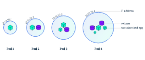
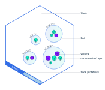
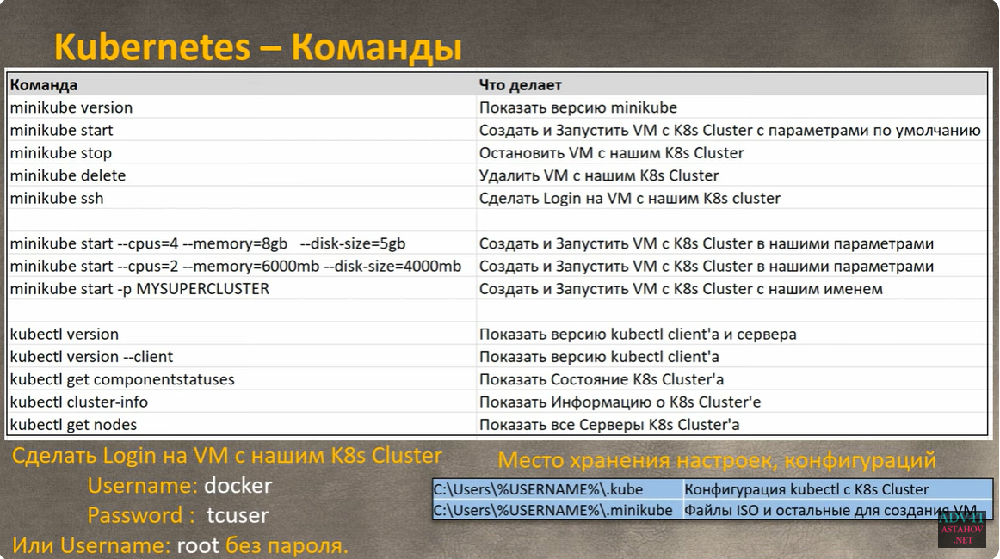

# Общие сведения

**Kubernetes (K8s)** - open source проект, разработанный Google на языке Go. Первая версия вышла в 2014.

**Kubernetes** — это портативная расширяемая платформа с открытым исходным кодом для управления контейнеризованными
рабочими нагрузками и сервисами, которая облегчает как декларативную настройку, так и автоматизацию.

Kubernetes предназначен для контейнеризированных приложений:

* Автоматизация развертывания приложений.
* Автоматизация масштабирования приложений.
* Автоматизации управления приложениями.

Используется главная контейнеризированная технология - **Docker**.

Основным компонентом Kubernetes является **Cluster**.

Cluster состоит из Nodes (серверов). Nodes бывают двух типов:

* **Worker Node** - сервер, на котором запускаются и работают контейнеры.
* **Master Node** - сервер, который управляет Worker Nodes.

Когда запускаются команды управления, они всегда посылаются на Master Node.

Master Node состоит из 4 процессов:

* **kube-api-server** (Предназначен для горизонтального масштабирования, то есть развёртывание на несколько экземпляров.
  Вы
  можете запустить несколько экземпляров kube-api-server и сбалансировать трафик между этими экземплярами)
* **kube-controller-manager** (Процесс, состоящий из нескольких контроллеров):
    * Контроллер узла (Node Controller): уведомляет и реагирует на сбои узла.
    * Контроллер репликации (Replication Controller): поддерживает правильное количество подов для каждого объекта
      контроллера репликации в системе.
    * Контроллер конечных точек (Endpoints Controller): заполняет объект конечных точек (Endpoints), то есть связывает
      сервисы (Services) и поды (Pods).
    * Контроллеры учетных записей и токенов (Account & Token Controllers): создают стандартные учетные записи и токены
      доступа API для новых пространств имен.
* **cloud-controller-manager**  отвечает за облачное взаимодействие.
* **kube-scheduler** (Отслеживает созданные поды без привязанного узла и выбирает узел, на котором они должны работать.
  При планировании развёртывания подов на узлах учитываются множество факторов, включая требования к ресурсам,
  ограничения, связанные с аппаратными/программными политиками, принадлежности (affinity) и непринадлежности (
  anti-affinity) узлов/подов, местонахождения данных, предельных сроков)
* **etcd** (Распределённое и высоконадёжное хранилище данных в формате "ключ-значение", которое используется как
  основное
  хранилище всех данных кластера в Kubernetes. Если ваш кластер Kubernetes использует etcd в качестве основного
  хранилища, убедитесь, что у вас настроено резервное копирование данных)

Worker Node состоит из 3 процессов:

* **kubelet** (Агент, работающий на каждом узле в кластере. Он следит за тем, чтобы контейнеры были запущены в поде.
  Утилита kubelet принимает набор PodSpecs, и гарантирует работоспособность и исправность определённых в них
  контейнеров. Агент kubelet не отвечает за контейнеры, не созданные Kubernetes)
* **kube-proxy** (Сетевой прокси, работающий на каждом узле в кластере, и реализующий часть концепции сервис. kube-proxy
  конфигурирует правила сети на узлах. При помощи них разрешаются сетевые подключения к вашими подам изнутри и снаружи
  кластера. kube-proxy использует уровень фильтрации пакетов в операционной системе, если он доступен. В противном
  случае kube-proxy сам обрабатывает передачу сетевого трафика.)
* **среда выполнения контейнера** (Исполняемая среда контейнера — это программа, предназначенная для запуска контейнера
  в
  Kubernetes. Kubernetes поддерживает различные среды для запуска контейнеров: Docker, containerd, CRI-O, и любые
  реализации Kubernetes CRI (Container Runtime Interface))

---

# Kubernetes cluster

Kubernetes cluster включает в себя как минимум 1 Master Node (их может быть больше, например, для повышения
availability).

И, как минимум, 1 Worker Node (их тоже может быть больше).

В Worker Node загружаются докер-контейнеры, которые создаются из докер-образов. Они хранятся в определенном Registry (
Dockerhub, AWS Container Registry ECR, Google Container Registry, Azure Container Registry).

---

# Возможности Kubernetes

### Service discovery and load balance (Мониторинг сервисов и распределение нагрузки)

Kubernetes может обнаружить контейнер, используя имя DNS или собственный IP-адрес. Если трафик в контейнере высокий,
Kubernetes может сбалансировать нагрузку и распределить сетевой трафик, чтобы развертывание было стабильным.

> Например, вы запустили один докер-контейнер в K8s cluster. K8s дает вам доступ к этому докер-контейнеру через
> IP-адрес, через определенный порт на любом Worker Node или через DNS имя, также если вы запустили несколько копий
> вашего
> докер-контейнера, K8s сделает Load balancing между этими контейнерами.

### Storage orchestration (Оркестрация хранилища)

Возможность администраторам выбирать определенные системы хранения для разных приложений. Kubernetes позволяет вам
автоматически смонтировать систему хранения по вашему выбору, такую как локальное хранилище, провайдеры общедоступного
облака и многое другое.

> Например, вы можете ПриАттачить любой локальный диск или диск из AWS, GCP или Azure к одному или нескольким Docker
> Containers.

### Automated rollouts and rollbacks (Автоматическое развертывание и откаты)

Используя Kubernetes, можно описать желаемое состояние развернутых контейнеров и изменить фактическое состояние на
желаемое. Например, вы можете автоматизировать Kubernetes на создание новых контейнеров для развертывания, удаления
существующих контейнеров и распределения всех их ресурсов в новый контейнер.

> Например, автоматическое обновление на новую версию Docker Image или возврат на предыдущую версию.

### Automatic bin packing (Автоматическое распределение нагрузки)

Вы предоставляете Kubernetes кластер узлов, который он может использовать для запуска контейнерных задач. Вы указываете
Kubernetes, сколько ЦП и памяти (ОЗУ) требуется каждому контейнеру. Kubernetes может разместить контейнеры на ваших
узлах так, чтобы наиболее эффективно использовать ресурсы.

> Например, вы создаете K8s Cluster, где K8s может запускать Docker Containers. Вы указываете сколько CPU и RAM нужно
> каждой копии Docker Container, чтобы нормально работать, K8s делает лучшие решения, на каких Worker Node запускать
> ваши
> Docker Containers.

### Self-healing (Самоконтроль)

Kubernetes перезапускает отказавшие контейнеры, заменяет и завершает работу контейнеров, которые не проходят
определенную пользователем проверку работоспособности, и не показывает их клиентам, пока они не будут готовы к
обслуживанию.

> Например, вы указываете сколько копий Docker Container вам нужно. Если что-то произошло с Container, K8s проверяет и
> заменяет неработающие Docker Containers.

### Secret and configuration management (Управление конфиденциальной информацией и конфигурацией)

Kubernetes может хранить и управлять конфиденциальной информацией, такой как пароли, OAuth-токены и ключи SSH. Вы можете
развертывать и обновлять конфиденциальную информацию и конфигурацию приложения без изменений образов контейнеров и не
раскрывая конфиденциальную информацию в конфигурации стека.

> Например, K8s позволяет вам хранить секреты: пароли или любую секретную информацию вне ваших приложений в Docker
> Container.

---

# Kubernetes Cloud сервисы

Все большие и не очень Cloud-провайдеры сделали поддержку Kubernetes. Вам предоставляется K8s Cluster и полное
управление им.

* AWS: Amazon Elastic Kubernetes Service (EKS)
* Google cloud platform (GCP): Google Kubernetes Engine (GKE)
* Azure: Azure Kubernetes Service (AKS)
* AliBaba: Container Service for Kubernetes (ACK)
* Yandex: Yandex Managed Service for Kubernetes

---

# Kubernetes Certifications

Существует несколько официальных сертификатов для Kubernetes. В стоимость входит возможность одной пересдачи. Работает
по принципу LPI.

---

# Поды и узлы

### Поды (Pods)

Под — это абстрактный объект Kubernetes, представляющий собой группу из одного или нескольких контейнеров приложения (
например, Docker) и совместно используемых ресурсов для этих контейнеров. Ресурсами могут быть:

* общее хранилище (тома);
* сеть (уникальный IP-адрес кластера);
* информация о том, как запускать каждый контейнер, например, версия образа контейнера или используемые номера портов.

Под представляет специфичный для приложения "логический хост" и может содержать разные контейнеры приложений, которые в
общем и целом тесно связаны. Например, в поде может размещаться как контейнер с приложением на Node.js, так и другой
контейнер, который получает некоторые данные для их дальнейшей публикации на веб-сервере Node.js. Все контейнеры в поде
имеют одни и те же IP-адрес и пространство портов, всегда размещаются и планируются для выполнения на одном и том же
узле.

**Поды** — неделимая единица в платформе Kubernetes. При создании деплоймента в Kubernetes создаются поды с контейнерами
внутри (вместо того, чтобы непосредственно создавать контейнеры). Каждый объект Pod связан с узлом (Node), на котором он
размещён, и остаётся там до окончания работы (согласно стратегии перезапуска) либо удаления. В случае неисправности узла
такой же под будет запланирован для запуска на других доступных узлах кластера.

Схема подов:



Описание пода (manifest file):

```yaml
apiVersion: v1
kind: Pod                                            # 1
metadata:
  name: sa-frontend                                  # 2
spec: # 3
  containers:
    - image: rinormaloku/sentiment-analysis-frontend # 4
      name: sa-frontend                              # 5
      ports:
        - containerPort: 80
```

1. Kind: задаёт вид ресурса Kubernetes, который мы хотим создать. В нашем случае это Pod.
2. Name: имя ресурса. Мы назвали его sa-frontend.
   Spec: объект, который описывает нужное состояние ресурса. Самое важное свойство здесь — это массив контейнеров.
3. Image: образ контейнера, который мы хотим запустить в данном поде.
4. Name: уникальное имя для контейнера, находящегося в поде.
5. ContainerPort: порт, который прослушивает контейнер. Этот параметр можно считать указанием для того, кто читает этот
   файл (если этот параметр опустить, это не ограничит доступ к порту).

### Узлы (Nodes)

Под всегда работает в узле (Node). **Узел** — это рабочая машина в Kubernetes, которая в зависимости от кластера может
быть либо виртуальной, либо физической. Каждый узел управляется компонентом под названием control plane. Узел может
содержать несколько подов, которые control plane автоматически размещает ("планирует" для запуска) на разные узлы
кластера. Автоматическое планирование (распределение подов по узлам) control plane учитывает доступные ресурсы на каждом
узле.

В каждом узле Kubernetes как минимум работает:

* Kubelet — процесс, отвечающий за взаимодействие между control plane и узлом; он управляет подами и запущенными
  контейнерами на рабочей машине.
* Среда выполнения контейнера (вроде Docker), отвечающая за получение (загрузку) образа контейнера из реестра,
  распаковку контейнера и запуск приложения.

Схема узла:



---

# Minikube & kubectl



---

# Deployment

**Развёртывание (Deployment)** — это абстракция Kubernetes, которая позволяет нам управлять тем, что всегда присутствует
в
жизненном цикле приложения. Речь идёт об управлении изменениями приложений. Приложения, которые не изменяются, это, так
сказать, «мёртвые» приложения. Если же приложение «живёт», то можно столкнуться с тем, что периодически изменяются
требования к нему, расширяется его код, этот код упаковывается и разворачивается. При этом на каждом шаге данного
процесса могут совершаться ошибки.

Ресурс вида Deployment позволяет автоматизировать процесс перехода от одной версии приложения к другой. Это делается без
прерывания работы системы, а если в ходе этого процесса произойдёт ошибка, у нас будет возможность быстро вернуться к
предыдущей, рабочей версии приложения.

```yaml
apiVersion: extensions/v1beta1
kind: Deployment                                          # 1
metadata:
  name: sa-frontend
spec:
  replicas: 2                                             # 2
  minReadySeconds: 15
  strategy:
    type: RollingUpdate                                   # 3
    rollingUpdate:
      maxUnavailable: 1                                   # 4
      maxSurge: 1                                         # 5
  template: # 6
    metadata:
      labels:
        app: sa-frontend                                  # 7
    spec:
      containers:
        - image: rinormaloku/sentiment-analysis-frontend
          imagePullPolicy: Always                         # 8
          name: sa-frontend
          ports:
            - containerPort: 80
```

1. **Kind**: тут указано, что мы описываем ресурс вида Deployment.
2. **Replicas**: свойство объекта спецификаций развёртывания, которое задаёт то, сколько экземпляров (реплик) подов
   нужно
   запустить.
3. **Type**: описывает стратегию, используемую в данном развёртывании при переходе с текущей версии на новую. Стратегия
   RollingUpdate обеспечивает нулевое время простоя системы при обновлении.
4. **MaxUnavailable**: это свойство объекта RollingUpdate, которое задаёт максимальное число недоступных подов (в
   сравнении
   с желаемым количеством подов) при выполнении последовательного обновления системы. В нашем развёртывании,
   подразумевающем наличие 2 реплик, значение этого свойства указывает на то, что после завершения работы одного пода
   ещё один будет выполняться, что делает приложение доступным в ходе обновления.
5. **MaxSurge**: это свойство объекта RollingUpdate, которое описывает максимальное число подов, которое можно добавить
   в
   развёртывание (в сравнении с заданным числом подов). В нашем случае его значение, 1, означает, что, при переходе на
   новую версию программы, мы можем добавить в кластер ещё один под, что приведёт к тому, что у нас могут быть
   одновременно запущены до трёх подов.
6. **Template**: этот объект задаёт шаблон пода, который описываемый ресурс Deployment будет использовать для создания
   новых
   подов. Вам эта настройка, наверняка, покажется знакомой.
7. **app**: sa-frontend: метка для подов, создаваемых по заданному шаблону.
8. **ImagePullPolicy**: определяет порядок работы с образами. В нашем случае это свойство установлено в значение Always,
   то
   есть, в ходе каждого развёртывания соответствующий образ будет загружаться из репозитория.

---

# Управление ресурсами

Можно настраивать минимальные требования и указывать жесткие требования.

За минимальные требования отвечает параметр requests, а за жесткие - limits.

```yaml
apiVersion: v1
kind: Pod
metadata:
  name: frontend
spec:
  containers:
    - name: app
      image: images.my-company.example/app:v4
      resources:
        requests:
          memory: "64Mi"
          cpu: "250m"
        limits:
          memory: "128Mi"
          cpu: "500m"
    - name: log-aggregator
      image: images.my-company.example/log-aggregator:v6
      resources:
        requests:
          memory: "64Mi"
          cpu: "250m"
        limits:
          memory: "128Mi"
          cpu: "500m"
```

Если мы не указываем requests, но указываем limits, тогда минимальными требованиями станут limits.

В kubernetes-кластере есть понятие отрицательный баланс ресурсов - ставка на то, что лимиты по ресурсам для отдельного
пода не будут достигнуты, иначе придется удалять некоторые из них (те, которые превышают выданные ресурсы). Также на это
влияют приоритеты подов.

### Namespace

Kubernetes поддерживает несколько виртуальных кластеров в одном физическом кластере. Такие виртуальные кластеры
называются `пространствами имён`.

По умолчанию в Kubernetes определены три пространства имён:

* default — пространство имён по умолчанию для объектов без какого-либо другого пространства имён.
* kube-system — пространство имён для объектов, созданных Kubernetes
* kube-public — создаваемое автоматически пространство имён, которое доступно для чтения всем пользователям (включая
  также неаутентифицированных пользователей). Как правило, это пространство имён используется кластером, если некоторые
  ресурсы должны быть общедоступными для всего кластера. Главная особенность этого пространства имён — оно всего лишь
  соглашение, а не требование.

#### ResourceQuota

**ResourceQuota определяет ограничения на namespace.**

* Количество объектов, создаваемых в namespace, по типу.
* Общий объем вычислительных ресурсов.
* Объём и количество дискового пространства для volumes.

**Квоты работают следующим образом:**

* Создается ResourceQuota в namespace.
* Пользователи создают объекты в namespace. Система отслеживает, не превышают ли запрошенные ресурсы лимиты, описанные в
  квотах.
* Если создание нового ресурса превышает квоту, API сервер возвращает 403-ю ошибку (FORBIDDEN) с сообщением о том, какие
  квоты были превышены.

**Типы квот**

Вычислительные:

* limits.cpu
* limits.memory
* requests.cpu
* requests.memory

Хранения:

* requests.storage
* persistentvolumeclaims
* <storage-class-name>.storageclass.storage.k8s.io/requests.storage
* <storage-class-name>.storageclass.storage.k8s.io/persistentvolumeclaims

Количество объектов:

* configmaps
* pods
* replicationcontrollers
* resourcequotas
* services
* services.loadbalancers
* services.nodeports
* secrets

`kubectl get namespaces`

`kubectl get pods --namespace test`

`kubectl get resourcequotas`

---

# Управление жизненным циклом

Kubelet использует `liveness` пробу для проверки, когда перезапустить контейнер. Например, liveness проба должна поймать
блокировку, когда приложение запущено, но не может ничего сделать. В этом случае перезапуск приложения может помочь
сделать приложение более доступным, несмотря на баги.

Kubelet использует `readiness` пробы, чтобы узнать, готов ли контейнер принимать траффик. Pod считается готовым, когда
все
его контейнеры готовы.

Одно из применений такого сигнала - контроль, какие Pod будут использованы в качестве бек-енда для сервиса. Пока Pod не
в статусе ready, он будет исключен из балансировщиков нагрузки сервиса.

Kubelet использует `startup` пробы, чтобы понять, когда приложение в контейнере было запущено. Если проба настроена, он
блокирует `liveness` и `readiness` проверки, до того как проба становится успешной, и проверяет, что эта проба не мешает
запуску приложения. Это может быть использовано для проверки работоспособности медленно стартующих контейнеров, чтобы
избежать убийства kubelet'ом прежде, чем они будут запущены.

```yaml
livenessProbe:
  exec:
    command:
      - cat
      - /tmp/healthy
  initialDelaySeconds: 5
  periodSeconds: 5
```

```yaml
readinessProbe:
  exec:
    command:
      - cat
      - /tmp/healthy
  initialDelaySeconds: 5
  periodSeconds: 5
```

```yaml
startupProbe:
  httpGet:
    path: /healthz
    port: liveness-port
  failureThreshold: 30
  periodSeconds: 10
```

---

# ConfigMap

Можно перейти с Spring Cloud Config на ConfigMap. Это данные, хранящиеся в формате ключ-значение.

В них хранятся не конфиденциальные данные, не превышающие размер 1MiB.

`1 MiB = 1024 * 1024 bytes`

Может быть создана из одного или нескольких файлов, например .yaml.

`kubectl create configmap <map-name> <data-source>`

`kubectl get configmaps`

---

# Secrets

**Создание:**

1. --from-literal
2. --from-file
3. --from-literal и --from-file с помощью задания стандартных настроек

**Использование:**

1. Переменная окружения
2. Аргумент командной строки
3. В качестве Volume

**Обновление данных:**

1. Если добавляем в конец ConfgiMap/Secret, тогда необходимо перезапускать под, чтобы подтянуть изменения. Иначе они не
   будут видны.
2. Если обновляется старое значение, тогда модуль его видит.
3. Если ConfigMap/Secret удалены, модуль будет использовать старые значения.

---

# ISTIO

> С помощью Service Mesh можно реализовать разные паттерны по управлению TCP-трафиком в проекте. Настраиваются они через
> декларативный язык с помощью API Kubernetes. Бонусом мы получаем расширенные возможности по наблюдаемости за проектом.

`ISTIO` - реализация Service Mesh.

**ISTIO решает следующие проблемы:**

- управление трафиком: таймауты, повторные попытки, балансировка нагрузки
- безопасность: аутентификация и авторизация конечного пользователя
- наблюдаемость: трассировка, мониторинг, логирование

ISTIO состоит из `Control Plane` и `Data Plane` (реализован самим подом)

В состав Control Plane входят: `Pilot` (обязательный компонент), `Mixer`, `Citadel`.

Pilot занимается централизованным управлением Envoy. Является единственным источником данных о состоянии среды (
хранилище).

Mixer - контроль доступа, телеметрия.

Citadel - основной элемент защиты. Управляет сертификатами и ключами. TLS.

Сервисы не знают о существовании ISTIO. Могут работать без него.

ISTIO - Circuit Breaker. В kubernetes используется kind DestinationRule.

---

# Service

`Сервис` – тип ресурса Kubernetes, который заставляет прокси настраиваться для пересылки запросов на набор контейнеров.
Набор контейнеров, которые будут получать трафик, определяется селектором соответствующим присвоенным при создании
контейнеров меткам. После создания сервиса мы видим, что ему был присвоен IP-адрес, и он будет принимать запросы на порт
80.

```yaml
kind: Service
apiVersion: v1
metadata:
  name: service-test
spec:
  selector:
    app: service_test_pod
  ports:
    - port: 80
      targetPort: http
```
