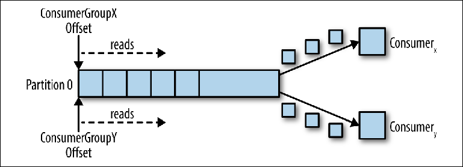

## Как обеспечить консистентность данных между 2 БД?

1. Двухфазные транзакции, если говорить строго, спецификация XA+, позволяющая создавать транзакции, распределенные
   относительно приложений — весьма тяжеловесный механизм, который мало кто любит и, что более важно, мало кто умеет
   настраивать.
2. Для решения задачи можно использовать многочисленные системы распределенного консенсуса (грубо говоря, все, что
   гуглится по ключевым словам paxos, raft, zookeeper, etcd, consul).

---

## Как обеспечить доставку данных между двумя сервисами (iMessage broker)?

* Синхронный протокол. Один из примеров — HTTP. Клиент отправляет запрос сервису и ожидает ответа. Важной особенностью
  протокола (HTTP/HTTPS) является синхронность. Дальнейшее исполнение клиентского кода возможно только после получения
  ответа от сервера HTTP.
* Асинхронный протокол. Пример — AMQP (поддерживается многими операционными системами и облачными средами). Код клиента
  или отправитель сообщения обычно не ожидают ответа. Они просто отправляют сообщение в сервис передачи сообщений, такой
  как RabbitMQ или Kafka (если используется управляемая событиями архитектура).

---

## Если нужно читать параллельно из Kafka, как будут читаться сообщения?

Проблему чтения можно представить следующим образом:

* Топик имеет несколько партиций.
* Использовать топик может одновременно множество групп консюмеров.
* Группа консюмеров может иметь несколько отдельных экземпляров.

> Консюмер запрашивает (polls) сообщения из топика, что приводит к их последовательному чтению из журнала.
> Позиция смещения регулярно коммитится обратно в Kafka и сохраняется, как сообщения во внутреннем топике _
> consumer_offsets. Прочитанные сообщения все равно не удаляются, в отличие от обычного брокера, и клиент может
> перемотать (rewind) смещение, чтобы повторно обработать уже просмотренные сообщения.
> Когда подключается второй логический консюмер, используя другой group_id, он управляет вторым указателем, который не
> зависит от первого. Таким образом, топик Kafka действует как очередь, в которой существует один консюмер и, как
> обычный
> топик издатель-подписчик (pub-sub), на который подписаны несколько консюмеров, с дополнительным преимуществом, что все
> сообщения сохраняются и могут обрабатываться несколько раз.



---

## Что использовать Kafka или HTTP для взаимодействия между сервисами?

Все зависит от задачи. HTTP применяется для синхронного взаимодействия, например, получить какие-нибудь данные по id
пользователя. Kafka применяется же при асинхронном взаимодействии, для снижения нагрузки.

---

## Сервис начал тормозить. Что делать (вопрос про GET метод)?

1. При запросе можно указывать список полей, которые хотим получить, чтобы уменьшить тело ответа.
2. Запрашивать данные не по отдельности, а сразу несколько (список).
3. Использовать фильтрацию и пагинацию.
4. Использовать batch запросы.

---

## Какие плюсы и минусы Hibernate

#### Плюсы:

* **Популярность.** По фреймворку много статей, обсуждений и уроков, на любой вопрос найдётся ответ.
* **Поддержка других инструментов.** Большинство библиотек и фреймворков Java работают с Hibernate без нареканий и
  сложных интеграций.
* **Облегчение кода.** С фреймворком программисту не нужно постоянно писать десятки одинаковых строк кода — программа
  становится понятнее, лаконичнее и легче.
* **Освобождение от рутины.** Разработчику не нужно писать огромное число запросов и «скучного» рутинного кода. Этим
  займётся Hibernate, и можно будет сосредоточиться на действительно сложных задачах, требующих творческого подхода.
* **Независимость от баз данных.** Не важно, какая БД используется в текущем проекте, — через Hibernate разработчику
  легко будет с ней работать.

#### Минусы:

* **Сложность в освоении.** Чтобы правильно писать код с Hibernate, нужно понимать принципы работы баз данных и знать
  синтаксис библиотеки. Этому придётся учиться.
* **Низкая производительность при использовании сложных моделей данных.** Несмотря на «ленивую загрузку», код,
  написанный с помощью Hibernate, обычно чуть медленнее и тяжелее чистого.
* **Непредсказуемость.** Из-за особенностей спецификации JPA значения в коде иногда могут изменяться, когда разработчики
  этого не задумывали. Такие моменты важно подмечать во время тестирования.
* **Неполное кэширование.** Кэш помогает улучшить производительность, однако в Hibernate нельзя кэшировать изменяемые
  функции. Это накладывает на разработчиков некоторые ограничения.

---

## В чем проблема N+1 и как ее решать?

> Проблема N + 1 возникает, когда фреймворк доступа к данным выполняет N дополнительных SQL-запросов для получения тех
> же данных, которые можно получить при выполнении одного SQL-запроса.

Эта проблема часто возникает при работе с отношениями между сущностями один-ко-многим, один-к-одному, при жадной и
ленивой загрузках.

Проблему можно решить, используя join fetch в HQL. Но у этого метода есть недостатки. Например, использование
методов `setMaxResults()` и `setFirstResult()`.

Также можно попробовать избавиться от проблемы, используя аннотацию
`@LazyToOne(LazyToOneOption.NO_PROXY)` для OneToOne или ManyToOne связи.

* `LazyToOneOption.NO_PROXY` - означает, что будет загружен реальный объект, а не прокси.
* `LazyToOneOption.FALSE` - жадная загрузка.
* `LazyToOneOption.PROXY` - означает, что будет загружен прокси-объект.

1. Избегать двухстороннего @OneToOne.
2. Везде использовать FetchType.Lazy.
3. Не использовать @BatchSize и @Fetch.
4. Использовать query fetch в HQL, Criteria API, QuerydsL. Но fetch нет в getById.
5. Использовать EntityGraph API, а не @FetchProfile.

---

## LazyInitializationException

Сменить FetchType на EAGER: @OneToMany(fetch = FetchType.EAGER)

Использовать загрузка коллекции открытым сеансом в представлении (транзакция в представлении).

> Open Session in View (или Transaction in View) — это шаблон проектирования, в котором соединение с базой данных будет
> оставаться открытым до конца пользовательского запроса. Когда приложение обращается к отложенной коллекции,
> Hibernate /
> JPA выполнит запрос к базе данных без проблем, исключений не будет.

Но при использовании этого подхода может возникнуть N+1 проблема.

---

## Open Session in View

> Open Session in View (или Transaction in View) — это шаблон проектирования, в котором соединение с базой данных будет
> оставаться открытым до конца пользовательского запроса. Когда приложение обращается к отложенной коллекции,
> Hibernate /
> JPA выполнит запрос к базе данных без проблем, исключений не будет.

Но при использовании этого подхода может возникнуть N+1 проблема.

---

## Какие уровни блокировок Optimistic/Pessimistic

**Оптимистичные блокировки** предполагают, что множество транзакций могут завершиться без влияния друг на друга, и таким
образом могут выполняться без блокировок тех ресурсов, на которые они влияют. Перед коммитом, каждая транзакция
проверяет, что ни одна другая транзакция не модифицировала ее данные. Если проверка выявила конфликтующие модификации,
транзакция, находящаяся в состоянии коммита, откатывается.

**Пессимистичная стратегия** подразумевает, что параллельные транзакции будут конфликтовать каждая друг с другом, и
требует
блокировки ресурсов после их чтения, а также ее снятия только после того, как приложение завершило использование данных.
Hibernate предоставляет механизмы для реализации обеих стратегий блокировок в вашем приложении.

---

## Способы внедрения Bean

1. Через конструктор.
2. Через поле + @Autowired.
3. Через сеттер + @Autowired.
4. Через фабричный метод.

---

## Что будет при циклической зависимости. Как разрешить?

Циклическая зависимость возникает, когда бин А зависит от бина Б, а бин Б - от А. Тогда при инициализации будет
выброшено исключение `BeanCurrentlyInCreationException`.

Решение:

1. Пересмотр архитектуры. Мне нравится использовать паттерн `декоратор` для решения циклических зависимостей.
2. Использовать аннотацию `@Lazy` в одном из конструкторов бина.
3. Внедрять зависимость через сеттер.
4. Использовать аннотацию `@PostConstruct`, чтобы в init-методе внедрить зависимость.
5. Реализовать интерфейсы `ApplicationContextAware` и `InitializingBean` (зачем его, если есть @PostConstruct).
   ApplicationContextAware позволяет засетать ApplicationContext, откуда можно будет достать нужный нам бин. А интерфейс
   InitializingBean заставляет нас переопределить метод для инициализации бина, где можно будет сделать инжект.

---

## Для чего нужны профили в Spring?

Профили Spring позволяют кастомизировать приложение для работы в различном окружении. В зависимости от активного профиля
можно инстанциировать различные реализации одного и того же бина, а также присваивать различные значения свойствам
приложения.

---

## Для чего нужна аннотация @ConditionalOnProperty?

Данная аннотация нужна, чтобы сообщить конфигурации или компоненту, что бины/бин будут создавать только при наличии
положительного значения константы в файле с пропертями. Например:

```java

@ConditionalOnProperty(
        value = "project.mq.enabled",
        matchIfMissing = false)
@Configuration
public class JmsConfig {
       ...
}
```

Если project.mq.enabled=true - бин будет создан, если false - нет.

---

## Как работает `@Transactional`?

Она указывает метод, который должен выполняться внутри транзакции базы данных. При использовании на уровне
класса `@Transactional` применяется ко всем методам этого класса и его подклассов.

Аннотация `@Transactional` автоматически создаст транзакцию при вызове метода, а коммит или откат будут управляться
Spring
неявно. Таким образом, декларативное управление транзакциями позволяет сократить объем шаблонного кода.

> Имейте в виду, что декларативная разметка работает только в том случае, если метод вызывается в экземпляре,
> инжектированном в другой бин, или полученном с помощью ApplicationContext.getBean(), то есть через созданный контейнером
> прокси. Вызов аннотированного метода из другого метода того же объекта не приведет к запуску транзакции.

---

## Всегда ли откатываются транзакции в `@Transactional`

